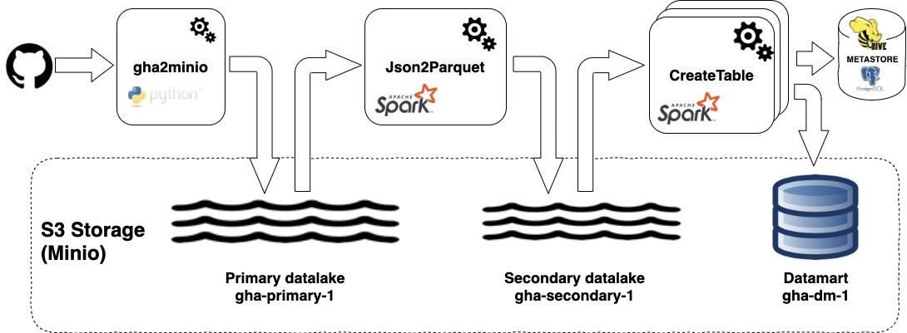
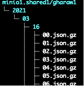
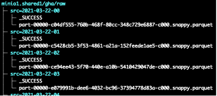

# KDP: POC Spark on Kubernetes/S3

<!-- START doctoc generated TOC please keep comment here to allow auto update -->
<!-- DON'T EDIT THIS SECTION, INSTEAD RE-RUN doctoc TO UPDATE -->


- [Overview](#overview)
- [Composant d'infrastructure](#composant-dinfrastructure)
  - [ArgoCD](#argocd)
  - [Minio](#minio)
    - [Déploiement](#d%C3%A9ploiement)
  - [Topolvm](#topolvm)
  - [Spark](#spark)
    - [Spark operateur](#spark-operateur)
  - [Hive Metastore](#hive-metastore)
  - [Postgresql](#postgresql)
- [Composant applicatifs](#composant-applicatifs)
  - [gha2minio](#gha2minio)
  - [Json2Parquet](#json2parquet)
  - [CreateTable](#createtable)
- [Déploiement et mise en oeuvre](#d%C3%A9ploiement-et-mise-en-oeuvre)
  - [Docker image registry](#docker-image-registry)
  - [Hive Metastore](#hive-metastore-1)
    - [Création de l'image docker.](#cr%C3%A9ation-de-limage-docker)
    - [Déploiement sur Kubernetes](#d%C3%A9ploiement-sur-kubernetes)
  - [Déploiement de l'arborescence Spark](#d%C3%A9ploiement-de-larborescence-spark)
  - [Configuration de l'arborescence Spark](#configuration-de-larborescence-spark)
  - [Generation de l'image Spark](#generation-de-limage-spark)
  - [Namespace and Account setup](#namespace-and-account-setup)
  - [Le script submit.sh](#le-script-submitsh)
  - [Fonctionnement local](#fonctionnement-local)
  - [Déploiement effectif](#d%C3%A9ploiement-effectif)
- [Next steps](#next-steps)

<!-- END doctoc generated TOC please keep comment here to allow auto update -->


## Overview

Le but de ce POC est de valider la faisabilité d'une double problématique :

- Déploiement Spark sur Kubernetes
- Remplacement de HDFS par un stockage object de type S3.

Pour ce POC, nous utiliserons les [archives Github](https://www.gharchive.org/).

Cette première étape n'integrera que des traitements batch. Les traitements en mode streaming pourrons faire l'objet d'une étude complémentaire.

Voici le schéma général :



- Github publie toute les heures un nouveau fichier regroupant toutes les opérations. Un premier module (gha2minio) se charge de collecter 
  ces fichiers et de les stocker tel quel dans un premier espace de stockage (Lac primaire). Ces fichiers sont au format json.
- Un second processus (Json2parquet) se charge de transformer ces données en format parquet, permettant ainsi de les voir comme une table unique. Ces données sont stockées dans un espace désigné comme Lac secondaire.
- Ensuite, des processus spécifiques (CreateTable) restructure cette table de base en une ou plusieurs tables adapté aux objectifs d'analyse. A la différence de la table de base, les définitions de ces tables sont référencées dans un metastore, basé sur celui utilisé par Hive. Les données elles même étant stockées dans S3, dans un troisième espace (Datamart).

A chacun de ces trois espaces correspond un bucket S3. 

Les détails du format de stockage seront décrit ultérieurement.

## Composant d'infrastructure

### ArgoCD 

ArgoCD est une application Kubernetes permettant l'automatisation des déploiements aussi bien applicatif que middleware. 

Il permet le pattern GitOps, évolution de l'IAC (Infrastructure As Code) en automatisant la réconciliation entre les définitions stockées dans Git et la réalité des applications déployés sur le cluster.

Avec ArgoCD, un déploiement peut lui-même être décrit sous la forme d'un manifest Kubernetes, ce qui permet le pattern appsOfApps.

L'ensemble des déploiements utilisés pour ce Poc sont [dans ce repo](https://github.com/BROADSoftware/depack). 

Pour pouvoir rentrer dans ce moule, un déploiement doit pouvoir être entièrement défini sous forme de manifest Kubernetes. Ce qui est généralement le cas, à l'exception de certain middlewares spécifiques. 

### Minio

Minio est un projet opensource fournissant un stockage de type S3 sur une infrastructure bare-metal. 
Dans notre contexte, il sera utilisé comme stockage principal pour tous les déployments hors cloud.

Outre la fonctionnalité serveur de stockage, Minio fournis aussi un interface CLI et des SDK dans différents languages, permettant l'accès à des fonctionnalités étendues. Mais, un serveur Minio est aussi accessible en utilisant les outils (CLI, libraries, SDK) standard AWS.

Dans le cadre de ce POC, Minio est configuré de manière 'secure', en utilisant https. Le certificat serveur étant émis par une autorité globale au cluster, il y aura donc lieux, pour les applications y accédant soit de fournir le certificat de cette autorité, soit de désactiver la vérification de validité du certificat serveur..

#### Déploiement

Le serveur Minio peut etre déployé directement sur les machines (VMs ou Bare-metal). Il peut aussi etres déployé sur une infrastructure Kubernetes. ceci soit:

- Directement, au travers d'une chartre Helm.
- Ou bien par l'intermédiaire d'un opérateur.

Cette deuxième méthode a été utilisée dans notre contexte. [Voir ici pour le déploiement](https://github.com/BROADSoftware/depack/tree/master/middlewares/minio.3.0.28)

### Topolvm

Topolvm est un driver CSI (Container Storage Interface) permettant la création dynamique de Logical Volume LVM et leur attachement aux containers applicatifs.

Il est notamment utilisé pour satisfaire les PVC (PersistantVolumeClaim) demandés par Minio.

Topolvm est déployé à la création du cluster. (Il est incompatible avec le pattern appsOfApps, car il nécessite notamment le déployement de modules systemd)

### Spark

Le fonctionnement de Spark sur Kubernetes est assez analogue à celui sur Yarn, excepté que driver et executors sont maintenant déployé dans des containers Kubernetes.

Dans le cadre de notre POC, l'autre différence est la substitution du stockage HDFS par S3

#### Spark operateur

Out of the box, le déploiement d'une application Spark consiste à lancer un spark-submit à l'extérieur du cluster. Ce pattern impératif n'est donc pas compatible avec une logique GitOps.

Un projet de google [Spark Operateur](https://github.com/GoogleCloudPlatform/spark-on-k8s-operator) permet de résoudre ce problème en permettant de définir une application spark de manière déclarative.

### Hive Metastore

Le Metastore Hive permet un référencement des métadonnées (Database, Tables, Column, etc...). Il est implémenté sous la forme d'un container, dont la construction est détaillé plus bas.

Il requiert un SGBD tel que PostgreSQL, Oracle ou MySQL. 

### Postgresql

Pour le Metastore Hive, PostgreSQL sera utilisé, dans sa version 9.6.

Le deploiement en est [ici](https://github.com/BROADSoftware/depack/tree/master/middlewares/postgresql/server)

A noter que dans le cadre de ce POC, la persistence est généralement assuré par un stockage local (En utilisant Topolvm). Ce qui implique une adhérence entre le serveur et le noeud qui le porte. Ceci est bien évidement inacceptable dans un contexte autre que celui d'un POC.

## Composant applicatifs

### gha2minio

Ce premier module permet donc de télécharger les archive Github. Celles-ci sont disponibles en téléchargement sous la forme suivante: 

`https://data.gharchive.org/<year>-<month>-<day>-<hour>.json.gz`

Par exemple: `https://data.gharchive.org/2015-01-01-15.json.gz`

Elles seront stockées dans notre S3 sous la forme:



La logique de gha2minio est la suivante: On va remonter dans le temps d'un certain nombre de jours (configurable) et regarder dans notre stockage S3 si le fichier correspondant est déja stocké. Si oui, on passe au suivant. Et si non, on le télécharge et on le sauvegarde.

Le processus s'arrête lorsque la tentative de téléchargement est infructueuse. Si l'on est à quelques heures du moment présent, on considère que l'on a terminé et que l'on recommencera plus tard, lorsuq'un nouveau fichier sera disponible. Et si l'on est éloigné du moment présent, on notifie une erreur.

Gha2minio est donc un processus fonctionnant en permanence, et allant, à interval régulier, effectuer une réconciliation entre ce qui est stocké et ce qui est disponible sur le site Github.

Voici un exemple de logs:

```
2021-03-27 13:36:17,276 - gha2minio.main - INFO - Will store Github archive since 2021-03-27 00:00:00 (checked until 2021-03-27 00:00:00)
2021-03-27 13:36:17,817 - gha2minio.main - INFO - File 'gharaw1//2021/03/27/00.json.gz already downloaded. Skipping
2021-03-27 13:36:17,838 - gha2minio.main - INFO - File 'gharaw1//2021/03/27/01.json.gz already downloaded. Skipping
2021-03-27 13:36:17,853 - gha2minio.main - INFO - File 'gharaw1//2021/03/27/02.json.gz already downloaded. Skipping
2021-03-27 13:36:17,901 - gha2minio.main - INFO - File 'gharaw1//2021/03/27/03.json.gz already downloaded. Skipping
2021-03-27 13:36:17,921 - gha2minio.main - INFO - File 'gharaw1//2021/03/27/04.json.gz already downloaded. Skipping
2021-03-27 13:36:17,945 - gha2minio.main - INFO - File 'gharaw1//2021/03/27/05.json.gz already downloaded. Skipping
2021-03-27 13:36:17,965 - gha2minio.main - INFO - File 'gharaw1//2021/03/27/06.json.gz already downloaded. Skipping
2021-03-27 13:36:17,988 - gha2minio.main - INFO - File 'gharaw1//2021/03/27/07.json.gz already downloaded. Skipping
2021-03-27 13:36:18,010 - gha2minio.main - INFO - File 'gharaw1//2021/03/27/08.json.gz already downloaded. Skipping
2021-03-27 13:36:18,040 - gha2minio.main - INFO - File 'gharaw1//2021/03/27/09.json.gz already downloaded. Skipping
2021-03-27 13:36:18,060 - gha2minio.main - INFO - File 'gharaw1//2021/03/27/10.json.gz already downloaded. Skipping
2021-03-27 13:36:18,080 - gha2minio.main - INFO - File 'gharaw1//2021/03/27/11.json.gz already downloaded. Skipping
2021-03-27 13:36:18,100 - gha2minio.main - INFO - Will try to download file '2021-03-27-12.json.gz' to '/data/downloaded.tmp'
2021-03-27 13:36:21,543 - gha2minio.main - INFO - File '2021-03-27-12.json.gz' has been downloaded into 'gharaw1//2021/03/27/12.json.gz'
2021-03-27 13:36:21,564 - gha2minio.main - INFO - Will try to download file '2021-03-27-13.json.gz' to '/data/downloaded.tmp'
2021-03-27 13:36:22,008 - gha2minio.main - INFO - Unsuccessful. No more file to download. End of work
2021-03-27 13:36:22,008 - gha2minio.main - INFO - Will be back on work in 30 seconds
```

Quelques autres points notables :

- Gha2minio est déployé dans un namespace dédié (gha1).
- Les patterns des nom de fichier d'entrés et de sortie sont configurable, ainsi que de nombreux paramètres de fonctionnement (Périodicité, durée de remonté dans le passé, limitation du nombre de téléchargement par itération, etc...)
- Gha2minio est développé en python et utilise le sdk Minio.
- L'ensemble des paramètres est passé en ligne de commande à l'exécutable. Lors de l'utilisation en container, un script wrapper de lancement construit cette ligne de commande à partir de variables d'environnement.
- Le Certificat racine permettant la validation de le connection https vers minio est monté sous forme de secret. A noter que ce certificat étant originellement présent dans un namespace différent, il y a lieux d'utiliser un [outil de réplication](https://github.com/mittwald/kubernetes-replicator).
- Les paramètres d'accès à Minio (Url, login, ...) sont aussi stocké sous forme de secret.

Le projet est accessible par ce lien: <https://github.com/gha2/gha2minio>.

Et le deploiement dans le cadre de notre POC: <https://github.com/BROADSoftware/depack/tree/master/apps/gha/gha2minio>.

### Json2Parquet

L'objet de cette application est donc de transformer les données brutes, stockées en format JSON en donnée exploitable facilement par Spark, sous la forme d'une table au format parquet. 

La logique de Json2Parquet est un peu équivalente à celle de Gha2Minio.

Les données résultantes sont stockées sous la forme d'une table parquet partitionné par un identifiant de fichier source



Ceci permet donc de fonctionner sur un principe de réconciliation, puisqu'il y une correspondance entre un fichier source (Format cible de gha2minio) et un répertoire/partition dans la table cible.

La transformation elle-même est simple

```
Dataset<Row> df = spark.read().format("json").option("inferSchema", "true").load(String.format("s3a://%s/%s", srcBucket, srcObject));
df.write().mode(SaveMode.Overwrite).save(String.format("s3a://%s/%s", dstBucket, dstObject));
```

Json2Parquet est un module de l'application spark/java [gha2spark](https://github.com/gha2/gha2spark).

Les patterns des noms de fichier d'entrés et de sortie sont configurable, ainsi que de nombreux paramètres de fonctionnement (Périodicité, durée de remonté dans le passé, limitation du nombre de transformation par itération, etc...).

Json2Parquet n'interagit pas avec le Metastore Hive et est indépendant de celui-ci.

Son utilisation effective est détaillée plus bas.

### CreateTable

Create table est un autre module de l'application spark/java [gha2spark](https://github.com/gha2/gha2spark).

Son objet est de générer une nouvelle table à partir d'une requête effectuée sur la table principale (Générée par Json2Parquet). Pour cela, un paramètre permet de passer une clause 'select': 

`--select "actor.login as actor, actor.display_login as actor_display, org.login as  org, repo.name as repo, type, payload.action, src"`

La table ainsi créée est référencée comme table externe dans le metastore Hive. Elle est régénérée complétement à chaque opération.

Un extrait du code décrivant l'opération principale :
```
Dataset<Row> df = spark.read().load(parameters.getSrcPath());
df.createOrReplaceTempView("_src_");
spark.sql(String.format("DROP TABLE IF EXISTS %s.%s", parameters.getDatabase(), parameters.getTable() ));
spark.sql(String.format("CREATE TABLE IF NOT EXISTS %s.%s USING PARQUET LOCATION 's3a://%s/%s' AS SELECT %s FROM _src_ "
        , parameters.getDatabase(), parameters.getTable()
        , parameters.getDatabase(), parameters.getTable()
        , parameters.getSelect()
));
```

## Déploiement et mise en oeuvre

### Docker image registry

Pour la bonne mise en oeuvre de ce POC, il est nécessaire de construite des images docker, qui devront ensuite êtres déployées dans le ou les clusters cible. 

Pour cela, le plus simpe est d'utiliser une 'Container Registry' publique, telle que Docker Hub. 

Toutefois, les récentes limitations de celui-ci, en termes de nombre de requètes ont conduit à trouver une alternative.

Pour ce POC, on utilisera donc la solution (gratuite) fournie par GitLab. 

### Hive Metastore

Dans le cadre de ce POC, le Metastore Hive a vocation à être containerisé pour fonctionner dans Kubernetes 

#### Création de l'image docker.

Le projet <https://github.com/gha2/standalone-hive-metastore> héberge le Dockerfile adéquat, et les scripts associés.

Ce Dokerfile part d'une image openjdk 1.8. Ensuite:

- Il télécharge les binaires d'une version standalone du Metastore Hive et les déploie.
- Il télécharge les binaires 'hadoop common' et les déploie.
- Il supprime une configuration log4j conflictuelle.
- Il ajoute les modules nécéssaire à la connection postgresql
- Il ajuste les droits pour permettre le fonctionnement sous un compte non-root 'hive'
- Il ajoute une configuration de sudoers, pour permettre de passer 'root'. Ceci est pratique pour la mise au point, mais devra etres supprimé par la suite. 
  (A noter que pour pouvoir passer 'root' il faut aussi utiliser PodSecurityPolicy libérale).
- Il copie le script de lancement.

Ce script de lancement accepte de nombreux paramètre en entrée, passés sous forme de variable d'environnement. 
A noter qu'il est susceptible d'initialiser la base de données si elle n'est pas présente, 
il est donc aussi nécéssaire de fournir les paramètres nécéssaires à cette initialisation.

Le script de lancement va donc:

- Tester la présence des paramètres obligatoires et fournir des valeurs par défaut pour les autres.
- Générer un fichier `metastore-log4j2.properties` avec un niveau de trace paramétrable.
- Générer le fichier de configuration principal `metastore-site.xml`, en y incluant les paramètres de configuration fournis sous forme de variable d'environnement. A noter que, même si les tables sont externes, le Metastore Hive effectue des accès au stockage S3. Il est donc nécessaire que celui-ci soit configuré correctement. Sinon, les tentatives de génération de table échoueront.  
- Attendre que le serveur postgresql soit disponible.
- Initialiser la base de donné si elle n'existe pas
- Lancer le métastore Hive

A noter en fin de script une astuce optionnelle retardant la fin d'exécution du script en cas d'erreur. Ceci pour permettre de visualiser les logs et/ou dans lancer un `kubectl exec ... /bin/sh` pour investiguer.

#### Déploiement sur Kubernetes

Le déploiement du Metastore Hive dans le cadre de notre POC est déini ici : <https://github.com/BROADSoftware/depack/tree/master/middlewares/hive-metastore>

Ce déploiement contient trois ressources:
- Un secret contenant les paramètres d'accès à Minio.
- Le deploiement lui-même.
- Le service permettant l'accès, avec éventuellement un point d'accès depuis l'exterieur

### Déploiement de l'arborescence Spark

L'ensemble des scripts et autres fichiers de configuration qui sont utilisé dans la suite de ce document sont regroupé dans le repository <https://github.com/gha2/gha-workbench>. Le plus simple est donc de le cloner sur votre système, et de se placer à sa racine.

Il est d'abord nécéssaire de déployer une arborescence Spark, pour deux usages:
- Etre à la base de la construction des images docker Spark.
- Permettre l'execution en local de spark-submit, spark-shell, etc....

Pour cela, il faut télécharger sur le site Spark la version `Pre-built for Apache Hadoop 3.2 and later`, puis de la déployer dans la racine de notre projet. 
On pourra aussi le renommer, pour simplifier le path

```
tar xvzf spark-3.1.1-bin-hadoop3.2.tgz
mv spark-3.1.1-bin-hadoop3.2 spark-3.1.1
```

L'archive pouvant ensuite êtres mise de coté 'au cas où'.

```
mv spark-3.1.1-bin-hadoop3.2.tgz archives/
```

Il faut maintenant rajouter dans cette arborescence deux fichiers jars permettant l'accès à S3. Mais, ceux-ci doivent correspondre strictement à la version précise d'Hadoop.
Le plus simple est donc de les extraire de la distribution correspondante. 

Il faut donc d'abord déterminer la version précise de l'Hadoop embarqué. Pour cela: 

```
ls ./spark-3.1.1/jars/hadoop*.jar
spark-3.1.1/jars/hadoop-annotations-3.2.0.jar			spark-3.1.1/jars/hadoop-mapreduce-client-jobclient-3.2.0.jar
spark-3.1.1/jars/hadoop-auth-3.2.0.jar				spark-3.1.1/jars/hadoop-yarn-api-3.2.0.jar
......
```

Dans notre cas, il s'agit donc de la version 3.2.0.

Nous pouvons donc récupérer l'archive correspondante, et en copier les fichiers qui nous interèssent dans notre déploiement Spark:

```
wget https://archive.apache.org/dist/hadoop/common/hadoop-3.2.0/hadoop-3.2.0.tar.gz
tar xvzf hadoop-3.2.0.tar.gz
cp ./hadoop-3.2.0/share/hadoop/tools/lib/hadoop-aws-3.2.0.jar spark-3.1.1/jars
cp ./hadoop-3.2.0/share/hadoop/tools/lib/aws-java-sdk-bundle-1.11.375.jar spark-3.1.1/jars
```

Nous pouvons ensuite supprimer le déploiement Hadoop et mettre l'archive de coté, au cas où :

```
rm -rf hadoop-3.2.0/
mv hadoop-3.2.0.tar.gz archives/
```

### Configuration de l'arborescence Spark

Il faut maintenant mettre en place certain fichiers de configuration :

> Les fichiers ajoutés ou modifiés sont accessible ici : <https://github.com/gha2/gha-workbench/tree/master/spark-3.1.1>

- Créer un fichier log4j en dupliquant le template (Pas de modification ici)

```
cp spark-3.1.1/conf/log4j.properties.template spark-3.1.1/conf/log4j.properties
```

- Configurer le fichier `spark-3.1.1/conf/spark-defaults.conf` avec les informations suivantes   

```
spark.hadoop.mapreduce.outputcommitter.factory.scheme.s3a org.apache.hadoop.fs.s3a.commit.S3ACommitterFactory
spark.hadoop.fs.s3a.committer.name directory
spark.hadoop.fs.s3a.committer.staging.tmp.path /tmp/spark_staging
spark.hadoop.fs.s3a.buffer.dir /tmp/spark_local_buf
spark.hadoop.fs.s3a.committer.staging.conflict-mode fail
spark.hadoop.fs.s3a.impl org.apache.hadoop.fs.s3a.S3AFileSystem
spark.hadoop.fs.s3a.path.style.access true

#spark.hadoop.fs.s3a.endpoint https://minio1.shared1/
#spark.hadoop.fs.s3a.access.key minio
#spark.hadoop.fs.s3a.secret.key minio123

#spark.hive.metastore.uris thrift://tcp1.shared1:9083
```

Les quatre dernières lignes devront être activées (dé-commentées) si l'on souhaite utiliser spark-sql, ou spark-shell en mode local, avec l'accès au Metastore Hive et aux données dans le stockage S3.

- Modifier le script `spark-3.1.1/kubernetes/dockerfiles/spark/entrypoint.sh` avec deux changements :
  - Ajouter une ligne `export _JAVA_OPTIONS="-Dcom.amazonaws.sdk.disableCertChecking=true"` avant le lancement des exécutables. Ceci afin d'admettre des certificats signées par une autorité inconnue. Ce qui est le cas dans le cadre de notre POC pour l'accès à Minio.
  - Ajouter une option `--verbose` au lancement du driver. Ceci est optionnel, et permet l'affichage des valeurs retenues pour la configuration.
  
  Voici un extrait de ce fichier avec les modifications.   

```
.....
export _JAVA_OPTIONS="-Dcom.amazonaws.sdk.disableCertChecking=true"

case "$1" in
driver)
shift 1
CMD=(
"$SPARK_HOME/bin/spark-submit"
--verbose
--conf "spark.driver.bindAddress=$SPARK_DRIVER_BIND_ADDRESS"
--deploy-mode client
.....
```

### Generation de l'image Spark

A partir de cette arborescence, il est maintenant simple de créer une image `spark`, qui sera téléchargé dans une registry accessible publiquement.

Spark fournis en effet les scripts nécessaires : 

```
./spark-3.1.1/bin/docker-image-tool.sh -r registry.gitlab.com/gha1 -t latest build
./spark-3.1.1/bin/docker-image-tool.sh -r registry.gitlab.com/gha1 -t latest push
```

A noter que cette image Spark est générique, c'est à dire qu'elle n'embarque pas de module applicatif.

### Namespace and Account setup

Bien qu'il soit possible de déployer nos applications Spark dans le namespace par défaut, et avec une compte de type 'superadmin',
les bonnes pratiques requièrent que l'on déploie dans un namespace dédié (Ou partagé avec d'autres applications) et à partir d'un compte limité au strict nécéssaire.

Créer cet environnement est l'objet du script <https://github.com/gha2/gha-workbench/blob/master/k8s/setup.sh>

> IMPORTANT: le bon fonctionnement de ce script nécessite la présence de deux petits utilitaires de manipulation [JSON (jq)](https://stedolan.github.io/jq/) et [YAML (yq)](https://mikefarah.gitbook.io/yq/). Il est donc nécessaire de les installer localement, en suivant la procédure adaptée au système d'exploitation.


Ce script va :

- Créer un namespace dédié ('spark' par défaut).
- Créer un compte de service.
- Créer un role RBAC avec les droits nécéssaires et suffisant pour lancer un Job Spark.
- Associer ce role au compte de service
- Générer localement un fichier de type 'kubconfig' permettant la connexion au cluster sous ce même compte de service. 

Bien sur, `kubectl` doit etres configuré pour accéder au cluster cible, avec les droits d'administration.

Voici le résultat de l'exécution de ce script :

```
$ ./setup.sh
namespace/spark created
serviceaccount/spark created
role.rbac.authorization.k8s.io/spark created
rolebinding.rbac.authorization.k8s.io/spark created
To switch to spark config:
export KUBECONFIG=/Users/sa/dev/g6/git/gha-workbench/k8s/kubeconfig.spark.kspray1.local
```

On peut donc couper/coller la dernière ligne pour s'identier sous le compte de service 'spark'

### Le script submit.sh

Traditionnellement, la commande `spark-submit` nécéssite un nombre important de paramètres, permettant de s'adapter au contexte.

Dans le cadre de ce POC, un wrapper est utliser pour mutualiser la plupart de ces paramètres. Il s'agit du script <https://github.com/gha2/gha-workbench/blob/master/k8s/submit.sh>.

> IMPORTANT: Comme le script setup.sh, le bon fonctionnement de ce script nécessite la présence de deux petits utilitaires de manipulation [JSON (jq)](https://stedolan.github.io/jq/) et [YAML (yq)](https://mikefarah.gitbook.io/yq/). Il est donc nécessaire de les installer localement, en suivant la procédure adaptée au système d'exploitation.

Les points particulier à noter:
- Le script intègre aussi la compilation des applications Spark. Ce qui implique que le projet [gha2sprak](https://github.com/gha2/gha2spark) soit déployé au même niveau que [gha-workbench](https://github.com/gha2/gha-workbench).
- La commande 'spark-submit' requiert que l'URL de l'API server soit passé en paramètre. Afin de simplifier l'interaction utilisateur, cette URL est automatiquement extraite du fichier pointé par $KUBECONFIG.
- Le script intègre une commande `export JAVA_TOOL_OPTIONS="-Dcom.amazonaws.sdk.disableCertChecking=true"`, afin de permettre l'accès à Minio en TLS avec un certificat issue d'une autorité non reconnue. Il faut noter que cela est nécéssaire à cet endroit, car le launcher lui-même vas devoir accéder au stockage S3 pour uploader le jar applicatif (gha2spark-0.1.0-uber.jar dans notre cas) passé avec l'oprion `file://...`.
- Ce script accept en premier parametre le nom de classe à lancer (Json2Parquet ou CreateTable dans notre cas). Les autre paramètres sont ensuite passés à cette classe.

Voici un exemple de lancement permettant de convertir un unique fichier :

```
./submit.sh Json2Parquet --backDays 0 --maxFiles 1 --waitSeconds 0 --srcBucketFormat gharaw1
```

Comme évoqué précédemment, la commande Json2Parquet travaille en reconciliation source / destination. Cette commande ne sera donc effective que si au moins un fichier JSON n'a pas encore sa partition parquet correspondante.

La commande suivante lance la commande Json2Parquet sous forme de daemon, qui, toute les 30 secondes, comparera source et destination et convertira tous les fichiers source non encore traités. 

```
./submit.sh Json2Parquet --backDays 0  --waitSeconds 30 --srcBucketFormat gharaw1
```

On pourra quitter la commande de lancement sans conséquence avec Ctrl-C. L'alternative étant dans ce cas d'ajouter l'option `--conf spark.yarn.submit.waitAppCompletion=false` dans le submit.sh


### Fonctionnement local


## Next steps

- spark operator
- Benchmark (TPC-DS, ....)
- Etude de l'utilisation du stockage (Spilling)
- Setup history server
- Limitation des ressources
- Gestion des droits S3
- Deployement AWS
- Etude DeltaLake
- Etude YuniKorn
- Access (beeline, JDBC, spark Thrift server)
- Jupyter notebook
- [Securisation](http://spark.apache.org/docs/latest/security.html).
- Meilleure gestion du certificat TLS Minio.(Actuellement disableCertCheck).  
- HDFS on kubernetes ?


