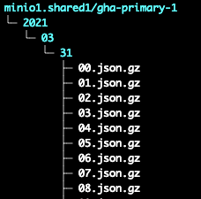
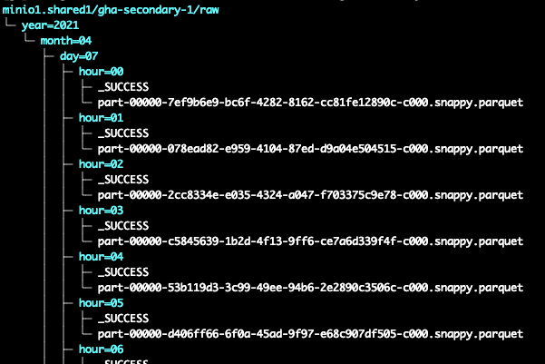

<table style="width: 100%"><tr>
    <td style="width: 33%; text-align: left"><a href="composants_infrastructure.md"><- Composant d'infrastructure</a></td>
    <td style="width: 33%; text-align: center"><a href="../README.md">HOME</a></td>
    <td style="width: 33%; text-align: right"><a href="deploiement.md">Déploiement et mise en oeuvre -></a></td>
</tr></table>

# Composants applicatifs

<!-- START doctoc generated TOC please keep comment here to allow auto update -->
<!-- DON'T EDIT THIS SECTION, INSTEAD RE-RUN doctoc TO UPDATE -->
**Index**

- [gha2minio](#gha2minio)
- [Json2Parquet](#json2parquet)
- [CreateTable](#createtable)

<!-- END doctoc generated TOC please keep comment here to allow auto update -->

## gha2minio

Ce premier module permet donc de télécharger les archive Github. Celles-ci sont disponibles en téléchargement sous la forme suivante :

`https://data.gharchive.org/<year>-<month>-<day>-<hour>.json.gz`

Par exemple: `https://data.gharchive.org/2015-01-01-15.json.gz`

Elles seront stockées dans notre S3 sous la forme:



La logique de `gha2minio` est la suivante: On va remonter dans le temps d'un certain nombre de jours (configurable) et regarder dans notre stockage S3 si le fichier correspondant est déja stocké. Si oui, on passe au suivant. Et si non, on le télécharge et on le sauvegarde.

Le processus s'arrête lorsque la tentative de téléchargement est infructueuse. Si l'on est à quelques heures du moment présent, on considère que l'on a terminé et que l'on recommencera plus tard, lorsqu'un nouveau fichier sera disponible. Et si l'on est éloigné du moment présent, on notifie une erreur.

`Gha2minio` est donc un processus fonctionnant en permanence, et allant, à interval régulier, effectuer une réconciliation entre ce qui est stocké et ce qui est disponible sur le site Github.

Voici un exemple de logs:

```
2021-03-27 13:36:17,276 - gha2minio.main - INFO - Will store Github archive since 2021-03-27 00:00:00 (checked until 2021-03-27 00:00:00)
2021-03-27 13:36:17,817 - gha2minio.main - INFO - File 'gharaw1//2021/03/27/00.json.gz already downloaded. Skipping
2021-03-27 13:36:17,838 - gha2minio.main - INFO - File 'gharaw1//2021/03/27/01.json.gz already downloaded. Skipping
2021-03-27 13:36:17,853 - gha2minio.main - INFO - File 'gharaw1//2021/03/27/02.json.gz already downloaded. Skipping
2021-03-27 13:36:17,901 - gha2minio.main - INFO - File 'gharaw1//2021/03/27/03.json.gz already downloaded. Skipping
2021-03-27 13:36:17,921 - gha2minio.main - INFO - File 'gharaw1//2021/03/27/04.json.gz already downloaded. Skipping
2021-03-27 13:36:17,945 - gha2minio.main - INFO - File 'gharaw1//2021/03/27/05.json.gz already downloaded. Skipping
2021-03-27 13:36:17,965 - gha2minio.main - INFO - File 'gharaw1//2021/03/27/06.json.gz already downloaded. Skipping
2021-03-27 13:36:17,988 - gha2minio.main - INFO - File 'gharaw1//2021/03/27/07.json.gz already downloaded. Skipping
2021-03-27 13:36:18,010 - gha2minio.main - INFO - File 'gharaw1//2021/03/27/08.json.gz already downloaded. Skipping
2021-03-27 13:36:18,040 - gha2minio.main - INFO - File 'gharaw1//2021/03/27/09.json.gz already downloaded. Skipping
2021-03-27 13:36:18,060 - gha2minio.main - INFO - File 'gharaw1//2021/03/27/10.json.gz already downloaded. Skipping
2021-03-27 13:36:18,080 - gha2minio.main - INFO - File 'gharaw1//2021/03/27/11.json.gz already downloaded. Skipping
2021-03-27 13:36:18,100 - gha2minio.main - INFO - Will try to download file '2021-03-27-12.json.gz' to '/data/downloaded.tmp'
2021-03-27 13:36:21,543 - gha2minio.main - INFO - File '2021-03-27-12.json.gz' has been downloaded into 'gharaw1//2021/03/27/12.json.gz'
2021-03-27 13:36:21,564 - gha2minio.main - INFO - Will try to download file '2021-03-27-13.json.gz' to '/data/downloaded.tmp'
2021-03-27 13:36:22,008 - gha2minio.main - INFO - Unsuccessful. No more file to download. End of work
2021-03-27 13:36:22,008 - gha2minio.main - INFO - Will be back on work in 30 seconds
```

Quelques autres points notables :

- `Gha2minio` est déployé dans un namespace dédié (`gha1`).
- Les patterns des nom de fichier d'entrés et de sortie sont configurable, ainsi que de nombreux paramètres de fonctionnement (Périodicité, durée de remonté dans le passé, limitation du nombre de téléchargement par itération, etc...)
- `Gha2minio` est développé en Python et utilise le sdk Minio.
- L'ensemble des paramètres est passé en ligne de commande à l'exécutable. Lors de l'utilisation en container, un script wrapper de lancement construit cette ligne de commande à partir de variables d'environnement.
- Le Certificat racine permettant la validation de le connection https vers Minio est monté sous forme de secret. A noter que ce certificat étant originellement présent dans un namespace différent, il y a lieux d'utiliser un [outil de réplication](https://github.com/mittwald/kubernetes-replicator).
- Les paramètres d'accès à Minio (Url, login, ...) sont aussi stockés sous forme de secret.

Le projet est accessible par ce lien: <https://github.com/gha2/gha2minio>.

Et le deploiement dans le cadre de notre POC: <https://github.com/BROADSoftware/depack/tree/master/apps/gha/gha2minio>.

## Json2Parquet

L'objet de cette application est de transformer les données brutes, stockées en format JSON en donnée exploitable facilement par Spark, sous la forme d'une table au format parquet.

La logique de `Json2Parquet` est un peu équivalente à celle de `gha2minio`.

Les données résultantes sont stockées sous la forme d'une table parquet partitionnée par années/mois/jours



Ceci permet donc de fonctionner sur un principe de réconciliation, puisqu'il y une correspondance entre un fichier source (Format cible de `gha2minio`) et un répertoire/partition dans la table cible.

La transformation elle-même est simple

```
Dataset<Row> df = spark.read().format("json").option("inferSchema", "true").load(String.format("s3a://%s/%s", srcBucket, srcObject));
df.write().mode(SaveMode.Overwrite).save(String.format("s3a://%s/%s", dstBucket, dstObject));
```

`dstObject` est un paramètre applicatif dont la valeur sera : `"raw/year={{year}}/month={{month}}/day={{day}}/hour={{hour}}"`

`Json2Parquet` est un module de l'application spark/java [gha2spark](https://github.com/gha2/gha2spark).

Les patterns des noms de fichier d'entré et de sortie sont configurable, ainsi que de nombreux paramètres de fonctionnement (Périodicité, durée de remonté dans le passé, limitation du nombre de transformation par itération, etc...).

`Json2Parquet` n'interagis pas avec le Metastore Hive et est indépendant de celui-ci.

Son utilisation effective est illustrée dans un autre chapitre de cette documentation.

## CreateTable

`CreateTable` est un autre module de l'application spark/java [gha2spark](https://github.com/gha2/gha2spark).

Son objet est de générer une nouvelle table à partir d'une requête effectuée sur la table principale (Générée par `Json2Parquet`). Pour cela, un paramètre permet de passer une requète qui sera inséré dans un CTAS (CreateTableAsSelect). Par exemple :

`--select "SELECT year, month, day, hour, actor.login as actor, actor.display_login as actor_display, org.login as  org, repo.name as repo, type, payload.action FROM _src_"`

`_src_` étant par convention le nom identifiant la table source.

La table ainsi créée est référencée comme table externe dans le metastore Hive. Elle est régénérée complétement à chaque opération.

Un extrait du code décrivant l'opération principale :

```
Dataset<Row> df = spark.read().load(parameters.getSrcPath());
df.createOrReplaceTempView("_src_");
spark.sql(String.format("DROP TABLE IF EXISTS %s.%s", parameters.getDatabase(), parameters.getTable() ));
spark.sql(String.format("CREATE TABLE IF NOT EXISTS %s.%s USING PARQUET LOCATION 's3a://%s/%s' AS %s "
        , parameters.getDatabase(), parameters.getTable()
        , parameters.getDstBucket(), parameters.getTable()
        , parameters.getSelect()
));
```

<table style="width: 100%"><tr>
    <td style="width: 33%; text-align: left"><a href="composants_infrastructure.md"><- Composant d'infrastructure</a></td>
    <td style="width: 33%; text-align: center"><a href="../README.md">HOME</a></td>
    <td style="width: 33%; text-align: right"><a href="deploiement.md">Déploiement et mise en oeuvre -></a></td>
</tr></table>