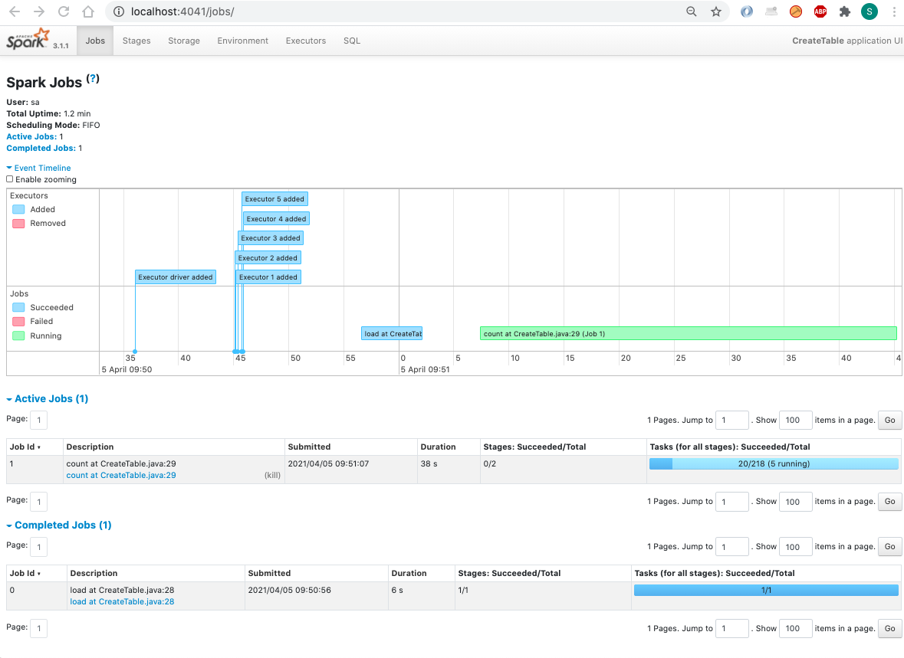

# Utilisation directe

Par 'utilisation directe', on entend le lancement de jobs Spark par la commande `spark submit`, par opposition à l'utilisation de l'opérateur Spark.

<!-- START doctoc generated TOC please keep comment here to allow auto update -->
<!-- DON'T EDIT THIS SECTION, INSTEAD RE-RUN doctoc TO UPDATE -->
**Index**

- [Le script submit.sh](#le-script-submitsh)
- [Exemples d'utilisation](#exemples-dutilisation)
- [Spark UI front end](#spark-ui-front-end)
- [Fonctionnement local](#fonctionnement-local)

<!-- END doctoc generated TOC please keep comment here to allow auto update -->

## Le script submit.sh

Traditionnellement, la commande `spark-submit` nécessite un nombre important de paramètres, permettant de s'adapter au contexte.

Dans le cadre de ce POC, un wrapper est utliser pour mutualiser la plupart de ces paramètres. Il s'agit du script <https://github.com/gha2/gha-workbench/blob/master/k8s/submit.sh>.

> IMPORTANT: Comme le script setup.sh, le bon fonctionnement de ce script nécessite la présence de deux petits utilitaires de manipulation [JSON (jq)](https://stedolan.github.io/jq/) et [YAML (yq)](https://mikefarah.gitbook.io/yq/). Il est donc nécessaire de les installer localement, en suivant la procédure adaptée au système d'exploitation.

Les points particuliers à noter :

- Le script intègre aussi la compilation des applications Spark. Ce qui implique que le projet [gha2sprak](https://github.com/gha2/gha2spark) soit déployé au même niveau que [gha-workbench](https://github.com/gha2/gha-workbench).
- Ce script requiert en premier paramètre le nom de classe à lancer (`Json2Parquet`, `CreateTable` ou `Count` dans notre cas) et en second paramètre le nom de l'application. Les autre paramètres sont ensuite passés à la classe.
- La commande `spark-submit` requiert que l'URL de l'API server soit passé en paramètre. Afin de simplifier l'interaction utilisateur, cette URL est automatiquement extraite du fichier pointé par $KUBECONFIG.
- Le script intègre une commande `export JAVA_TOOL_OPTIONS="-Dcom.amazonaws.sdk.disableCertChecking=true"`, afin de permettre l'accès à Minio en TLS avec un certificat émis  par une autorité non reconnue. Il faut noter que cela est nécéssaire à cet endroit, car le launcher lui-même vas devoir accéder au stockage S3 pour uploader le jar applicatif (`gha2spark-0.1.0-uber.jar` dans notre cas) passé avec l'option `file://...`.
- Le fait que le stockage S3 soit accédé aussi bien par le launcher que par les containers spark impose de fournir un point d'entré accessible aussi bien de l'extérieur du cluster que depuis un Pod. (Cette remarque n'est valable que parce que les jobs Spark et Minio sont sur le même cluster K8S).
- Le Launcher va utiliser les valeurs courantes de `spark-3.1.1/conf/spark-defaults.conf` et `spark-3.1.1/conf/log4j.properties` pour construire une ressource de type ConfigMap, qui sera utilisée par les Pod Spark.
- Le script configure aussi les ressources allouées au driver et aux executors.

## Exemples d'utilisation

> Il est impératif de configurer `spark-3.1.1/conf/spark-defaults.conf` ET `submit.sh` avec les valeurs d'accès au stockage S3.

Voici un exemple de lancement permettant de convertir un fichier du datalake primaire (JSON) vers le secondaire (Parquet) :

```
./submit.sh Json2Parquet json2parquet --backDays 0 --maxFiles 1 --waitSeconds 0 --srcBucketFormat gha-primary-1 \
--dstBucketFormat gha-secondary-1 --dstObjectFormat "raw/year={{year}}/month={{month}}/day={{day}}/hour={{hour}}"
```

Comme évoqué précédemment, la commande `Json2Parquet` travaille en reconciliation source / destination. Cette commande ne sera donc effective que si au moins un fichier JSON n'a pas encore sa partition correspondante.

La commande suivante lance maintenant la commande `Json2Parquet` sous forme de daemon, qui, toute les 30 secondes, comparera source et destination et convertira tous les fichiers source non encore traités.

```
./submit.sh Json2Parquet j2p-daemon --backDays 9 --waitSeconds 30 --srcBucketFormat gha-primary-1 \
--dstBucketFormat gha-secondary-1 --dstObjectFormat "raw/year={{year}}/month={{month}}/day={{day}}/hour={{hour}}"
```

On pourra quitter la commande de lancement sans conséquence avec Ctrl-C. L'alternative étant dans ce cas d'ajouter l'option `--conf spark.yarn.submit.waitAppCompletion=false` dans le `submit.sh`.

On peut maintenant valider le bon fonctionnement de la commande `CreateTable`, en créant une table `t1`, référencée dans une database `gha_dm_1` dans le metastore :

```
time ./submit.sh CreateTable create-t1 --metastore thrift://metastore.spark-system.svc:9083 --srcPath s3a://gha-secondary-1/raw \
--database gha_dm_1 --table t1 --dstBucket gha-dm-1 \
--select "SELECT year, month, day, hour, actor.login as actor, actor.display_login as actor_display, org.login as  org, repo.name as repo, type, payload.action FROM _src_ WHERE year='2021' AND month='03' AND day='30' AND hour='00'"
```

> As the metastore is accessed only from the spark containers, internal (Kubernetes service) address can be provided.

> La clause WHERE permet de ne sélectionner qu'une journée, afin d'avoir une durée d'execution raisonnable.

Ou bien, si l'on souhaite avoir un résultat ordonné :

```
time ./submit.sh CreateTable create-t2 --metastore thrift://metastore.spark-system.svc:9083 --srcPath s3a://gha-secondary-1/raw \
--database gha_dm_1 --table t2 --dstBucket gha-dm-1 \
--select "SELECT year, month, day, hour, actor.login as actor, actor.display_login as actor_display, org.login as  org, repo.name as repo, type, payload.action FROM _src_ WHERE year='2021' AND month='03' AND day='30' AND hour='00' ORDER BY repo"
```

On peut vérifier la bonne création de cette table en utilisant un `spark-shell` local :

> Pour que le `spark-shell` puisse accéder au metastore, il faut que la valeur de `spark.hive.metastore.uris` dans le fichier `spark-3.1.1/conf/spark-defaults.conf` soit configuré sur un point d'accès externe au metastore. Comme le protocole `thrift` n'est pas supporté par l'ingress controller, ce point d'accès devra est une IP attribuée à un load balancer.

```
$ export _JAVA_OPTIONS="-Dcom.amazonaws.sdk.disableCertChecking=true"
$ ./spark-3.1.1/bin/spark-shell
Picked up _JAVA_OPTIONS: -Dcom.amazonaws.sdk.disableCertChecking=true
.....
scala> spark.sql("show databases;").show
+---------+
|namespace|
+---------+
|  default|
| gha_dm_1|
+---------+

scala> spark.sql("show tables in gha_dm_1;").show
+--------+---------+-----------+
|database|tableName|isTemporary|
+--------+---------+-----------+
|gha_dm_1|       t1|      false|
+--------+---------+-----------+

scala> spark.sql("SELECT * FROM gha_dm_1.t1 LIMIT 20;").show
21/03/31 23:11:13 WARN MetricsConfig: Cannot locate configuration: tried hadoop-metrics2-s3a-file-system.properties,hadoop-metrics2.properties
21/03/31 23:11:14 WARN AmazonHttpClient: SSL Certificate checking for endpoints has been explicitly disabled.
+----+-----+---+----+--------------------+--------------------+-----------------+--------------------+---------+------+
|year|month|day|hour|               actor|       actor_display|              org|                repo|     type|action|
+----+-----+---+----+--------------------+--------------------+-----------------+--------------------+---------+------+
|2021|    4|  3|   6| albertoabellagarcia| albertoabellagarcia|smart-data-models|smart-data-models...|PushEvent|  null|
|2021|    4|  3|   6|          ypravesh96|          ypravesh96|             null|   ypravesh96/dayone|PushEvent|  null|
|2021|    4|  3|   6|         myreaderx21|         myreaderx21|             null|   myreaderx21/cdn31|PushEvent|  null|
|2021|    4|  3|   6|         myreaderx16|         myreaderx16|             null|   myreaderx16/cdn62|PushEvent|  null|
|2021|    4|  3|   6|         myreaderx24|         myreaderx24|             null|   myreaderx24/cdn10|PushEvent|  null|
|2021|    4|  3|   6|           myreaderx|           myreaderx|             null|      myreaderx/cdn8|PushEvent|  null|
|2021|    4|  3|   6|         myreaderx29|         myreaderx29|             null|   myreaderx29/cdn84|PushEvent|  null|
|2021|    4|  3|   6|         myreaderx12|         myreaderx12|             null|   myreaderx12/cdn55|PushEvent|  null|
|2021|    4|  3|   6|           jinmanshe|           jinmanshe|             null| jinmanshe/qimanshe1|PushEvent|  null|
|2021|    4|  3|   6|         myreaderx30|         myreaderx30|             null|   myreaderx30/cdn86|PushEvent|  null|
|2021|    4|  3|   6|         myreaderx11|         myreaderx11|             null|   myreaderx11/cdn82|PushEvent|  null|
|2021|    4|  3|   6|Pete-PlaytimeSolu...|Pete-PlaytimeSolu...|playtimesolutions|playtimesolutions...|PushEvent|  null|
|2021|    4|  3|   6|           myreaderx|           myreaderx|             null|     myreaderx/cdn29|PushEvent|  null|
|2021|    4|  3|   6|         myreaderx33|         myreaderx33|             null|   myreaderx33/cdn17|PushEvent|  null|
|2021|    4|  3|   6|         myreaderx19|         myreaderx19|             null|   myreaderx19/cdn15|PushEvent|  null|
|2021|    4|  3|   6|           hohograce|           hohograce|             null|hohograce/FoodSafety|PushEvent|  null|
|2021|    4|  3|   6|         myreaderx18|         myreaderx18|             null|   myreaderx18/cdn26|PushEvent|  null|
|2021|    4|  3|   6|          myreaderx2|          myreaderx2|             null|    myreaderx2/cdn22|PushEvent|  null|
|2021|    4|  3|   6| github-actions[bot]|      github-actions|             null| Babelovo/auto_green|PushEvent|  null|
|2021|    4|  3|   6|         myreaderx32|         myreaderx32|             null|   myreaderx32/cdn75|PushEvent|  null|
+----+-----+---+----+--------------------+--------------------+-----------------+--------------------+---------+------+

scala>
```

Trois conditions pour que cela fonctionne :

- Executer `export _JAVA_OPTIONS="-Dcom.amazonaws.sdk.disableCertChecking=true"` avant de lancer `spark-shell`, car sinon l'accès au stockage S3 ne peut s'effectuer.
- Avoir configuré l'accès S3 dans le fichier `./spark-3.1.1/conf/spark-defaults.conf`
- Que le `spark-shell` puisse accéder au metastore. Pour cela, il faut que la valeur de `spark.hive.metastore.uris` dans ce fichier `spark-3.1.1/conf/spark-defaults.conf` soit configurée sur un point d'accès externe au metastore.

> Comme le protocole `thrift` n'est pas supporté par l'ingress controller, ce point d'accès devra est une IP attribuée à un load balancer.


## Spark UI front end

Lors de l'exécution d'un job spark, le driver offre un front-end web permettant de monitorer l'éxécution des tâches.

Cette interface est accessible sur le port 4040 du container.

Il est donc possible d'avoir accès à cette interface avec la commande `port-forward`. Par exemple :

```
kubectl -n spark port-forward j2p-daemon-8e7b35789c1c9f50-driver 4041:4040
```

On pourra ensuite pointer son navigateur sur <http://localhost:4041>

A noter que le driver doit etre dans l'état `Running`. Ce qui est le cas s’il est lancé en tant que daemon.

La tache `CreateTable` durant généralement plusieurs minutes, il est aussi possible d'accéder à son interface durant sont exécution :



Après la fin du traitement, le container passe dans l'état `completed`. Les journaux d'événement sont alors sauvegardés et sont maintenant accessible au travers du `Spark history server`, déployé à cet effet.


## Fonctionnement local

Durant les phases de mise au point, afin de raccourcir le cycle de test, il peut être plus simple de tester les différents modules hors d'un contexte Kubernetes.

Pour cela, on pourra utiliser le script `submit-local.sh`. On pourra aussi utiliser les différents `docker-compose.yml` des répertoires `./stackX` pour instancier Minio, Postgresql, ... hors de Kubernetes. 
